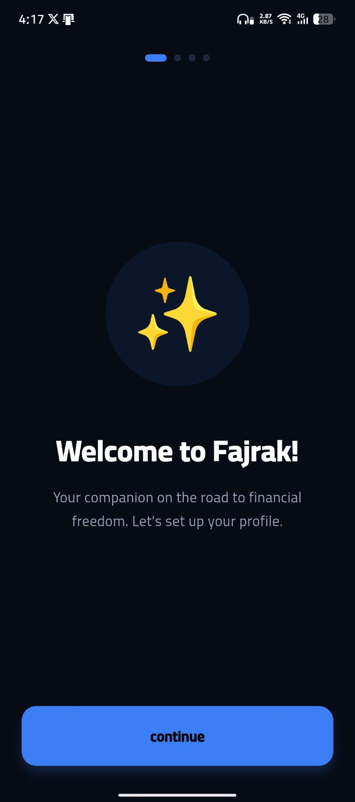
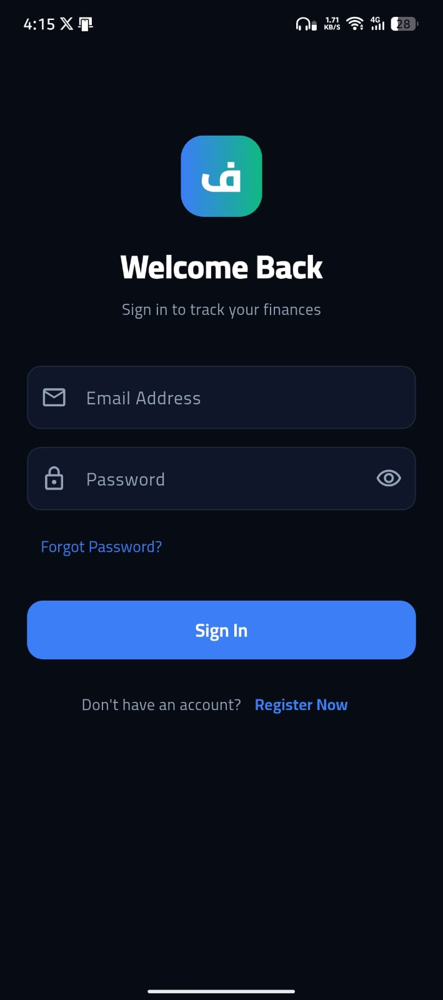
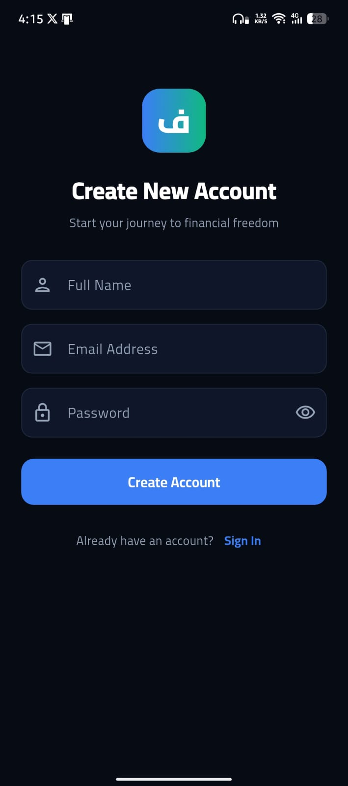
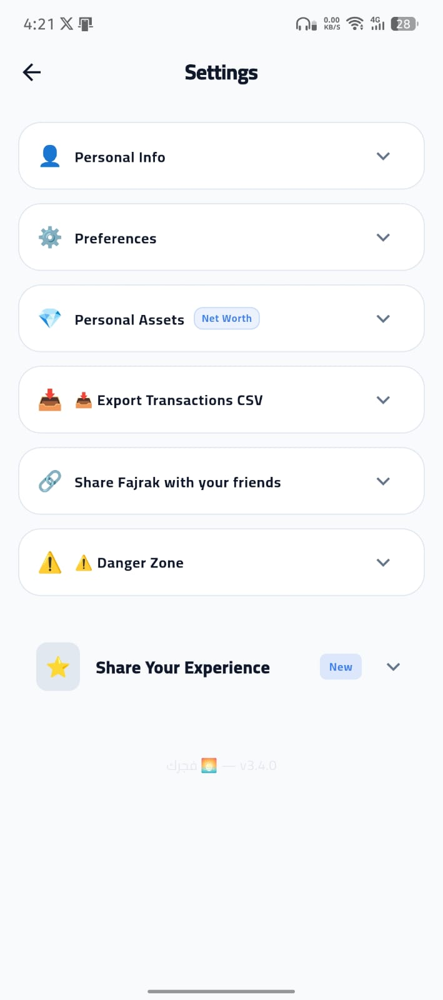
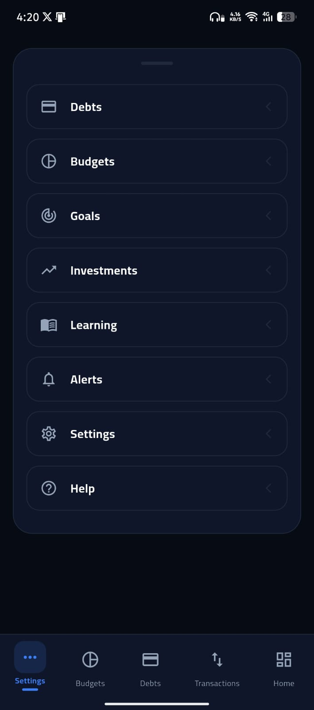

  

    
    
    <h1>Fajrak — فجرك 🌅</h1>
    
منصة إدارة مالية شخصية ذكية

    
Smart Personal Finance Manager

    
    

      <a href="https://fajrak.com" class="nav-pill">🌐 العرض التجريبي</a>
      <a href="https://fajrak.com/download" class="nav-pill">📱 التحميل</a>
      <a href="https://github.com/Abdoocoder/financetracker" class="nav-pill">💻 الكود المصدري</a>
    

    
    

      <a href="./README.md">🇬🇧 English</a>
      <a href="./README.ar.md" class="active">🇸🇦 العربية</a>
    

  

  
  <!-- Vision Section -->
  <section class="section">
    

      <h2>✨ رؤيتنا</h2>
      
تمكين الوعي المالي لكل أسرة عربية

    

    
    

      
🌟 بيان الرؤية

      
أن يكون كل إنسان على دراية كاملة بوضعه المالي، ويملك خطة واضحة للتحسين — بغض النظر عن دخله أو مستواه — حتى ينجح في تحقيق <strong>حريته المالية</strong>.

    

    
    

      

        
🌅

        
وعي مالي

      

      

        
💳

        
سداد الديون

      

      

        
🛡️

        
صندوق طوارئ

      

      

        
📈

        
استثمار

      

      

        
👑

        
حرية مالية

      

    

  </section>
  
  <!-- Screenshots Section -->
  <section class="section" style="margin-top: 60px;">
    

      <h2>📸 لقطات الشاشة</h2>
      
شاهد فجرك في action

    

    
    

      

        
        
🌅 الترحيب

      

      
      

        
        
🔐 الدخول

      

      
      

        
        
📝 التسجيل

      

      
      

        
        
⚙️ الإعدادات

      

      
      

        
        
📱 المزيد

      

    

    
    

      
      
📱 فجرك — مدير المالية الشخصية الذكي

    

  </section>
  
  <!-- Features Section -->
  <section class="section" style="margin-top: 60px;">
    

      <h2>🚀 الميزات الرئيسية</h2>
      
كل ما تحتاجه لإدارة أموالك باحترافية

    

    
    

      

        🏠
        <h3>لوحة التحكم</h3>
        <ul>
          <li>ملخص شهري: الدخل، المصروف، الصافي</li>
          <li>نقاط الصحة المالية — من 0 إلى 100</li>
          <li>خارطة الثراء — 5 مراحل مالية</li>
          <li>محاكي الثروة — حساب نمو الفائض</li>
          <li>تحديات الادخار — 4 تحديات تلقائية</li>
          <li>رسوم بيانية تفاعلية مع Recharts</li>
          <li>إضافة سريعة مع تكرار آخر معاملة</li>
          <li><strong>تحسين الأداء بنسبة 94%</strong></li>
        </ul>
      

      
      

        💸
        <h3>المعاملات المالية</h3>
        <ul>
          <li>إضافة / تعديل / حذف المعاملات</li>
          <li>معاملات متكررة — تنفذ تلقائياً</li>
          <li>قادمة ومنجزة</li>
          <li>بحث نصي + فلترة بالنوع والشهر</li>
          <li>سحب للحذف على الموبايل</li>
          <li>تصدير CSV</li>
        </ul>
      

      
      

        💳
        <h3>إدارة الديون</h3>
        <ul>
          <li>شريط تقدم مرئي</li>
          <li>خصم تلقائي شهري (CRON)</li>
          <li>تحديد يوم الخصم لكل دين</li>
          <li>سجل كامل للدفعات</li>
          <li>احتفال Confetti عند السداد الكامل</li>
        </ul>
      

      
      

        📊
        <h3>الميزانية الذكية</h3>
        <ul>
          <li>ملخص تلقائي من بيانات التطبيق</li>
          <li>مستشار مالي ذكي — تحليل وتوصيات</li>
          <li>قاعدة 50/30/20 — توزيع تلقائي</li>
          <li>حدود إنفاق يدوية لكل فئة</li>
          <li>تحذيرات عند الاقتراب أو التجاوز</li>
        </ul>
      

      
      

        📈
        <h3>الاستثمارات</h3>
        <ul>
          <li>أسهم + عملات رقمية (15+ عملة)</li>
          <li>أسعار حية محدثة</li>
          <li>دعم الاستثمار الحلال ✅</li>
          <li>محاكي الثروة التفاعلي</li>
          <li>ملخص المحفظة الاستثمارية</li>
        </ul>
      

      
      

        🔔
        <h3>التنبيهات الذكية</h3>
        <ul>
          <li>Firebase FCM للأندرويد</li>
          <li>Web Push للآيفون</li>
          <li>تقارير صباحية ومسائية وأسبوعية</li>
          <li>سياسة ذكية — إشعارات مفيدة فقط</li>
          <li>إدارة اشتراكات Push</li>
        </ul>
      

      
      

        📖
        <h3>الدروس اليومية الإسلامية</h3>
        <ul>
          <li>آيات قرآنية عن الرزق</li>
          <li>أحاديث عن الأخلاق المالية</li>
          <li>أدعية يومية</li>
          <li>مخصصة حسب مرحلتك المالية</li>
          <li>25 درس علمي جديد</li>
        </ul>
      

      
      

        🎯
        <h3>نظام الإنجازات</h3>
        <ul>
          <li>نظام مستويات حسب نقاط الصحة</li>
          <li>شارات الإنجاز</li>
          <li>تتبع السلسلة اليومية</li>
          <li>معالم التعلم</li>
          <li>تحديات مالية</li>
        </ul>
      

    

  </section>
  
  <!-- Mobile Apps Section -->
  <section class="section" style="margin-top: 60px;">
    

      <h2>📱 منصات الهاتف</h2>
      
استخدم فجرك من أي جهاز

    

    
    

      

        🤖
        <h3>أندرويد</h3>
        
تطبيق Flutter أصلي مع كامل الميزات

        
✅ متوفر على Play Store

      

      
      

        🌐
        <h3>PWA / TWA</h3>
        
تطبيق ويب متقدم مع إنشاء APK

        
✅ تحميل APK

      

      
      

        🍎
        <h3>آيفون</h3>
        
إضافة إلى الشاشة الرئيسية PWA

        
✅ مدعوم

      

    

  </section>
  
  <!-- Tech Stack Section -->
  <section class="section" style="margin-top: 60px;">
    

      <h2>⚙️ التقنيات المستخدمة</h2>
      
مبني بأحدث التقنيات الحديثة

    

    
    

      

        
⚡

        <h4>Next.js 15</h4>
        
إطار عمل React مع App Router و SSR

        إطار العمل
      

      
      

        
🔷

        <h4>TypeScript</h4>
        
سلامة كاملة للأنواع

        اللغة
      

      
      

        
🗄️

        <h4>Supabase</h4>
        
قاعدة بيانات PostgreSQL و Auth و RLS

        الخادم
      

      
      

        
🔥

        <h4>Firebase</h4>
        
Cloud Messaging للإشعارات (FCM)

        الإشعارات
      

      
      

        
📱

        <h4>Flutter 3.x</h4>
        
تطبيق أندرويد أصلي

        الهاتف
      

      
      

        
🚀

        <h4>Vercel</h4>
        
نشر بدون خادم مع edge functions

        الاستضافة
      

      
      

        
📊

        <h4>Recharts</h4>
        
رسوم بيانية تفاعلية

        الرسوم
      

      
      

        
⏰

        <h4>cron-job.org</h4>
        
أتمتة مجدولة (عمان UTC+3)

        الأتمتة
      

    

  </section>
  
  <!-- Database Schema Section -->
  <section class="section" style="margin-top: 60px;">
    

      <h2>🗄️ هيكل قاعدة البيانات</h2>
      
نموذج بيانات شامل مع حماية RLS

    

    
    

      
🔒 أمان أولاً

      
جميع الجداول محمية بـ <strong>Row Level Security (RLS)</strong>، مما يضمن أن كل مستخدم يمكنه الوصول لبياناته فقط.

    

    
    

      

        <h4>📋 الجداول الأساسية</h4>
        <ul style="text-align: right; margin-top: 15px;">
          <li>profiles — بيانات المستخدم</li>
          <li>transactions — المعاملات</li>
          <li>debts — الديون</li>
          <li>debt_payments — سجل الدفعات</li>
        </ul>
      

      
      

        <h4>💰 المالي</h4>
        <ul style="text-align: right; margin-top: 15px;">
          <li>investments — الاستثمارات</li>
          <li>budgets — الميزانيات</li>
          <li>savings_goals — أهداف الادخار</li>
        </ul>
      

      
      

        <h4>🔔 النظام</h4>
        <ul style="text-align: right; margin-top: 15px;">
          <li>alerts — التنبيهات</li>
          <li>push_subscriptions — الاشتراكات</li>
          <li>user_stats — الإحصائيات</li>
          <li>testimonials — التقييمات</li>
        </ul>
      

    

  </section>
  
  <!-- Automation Section -->
  <section class="section" style="margin-top: 60px;">
    

      <h2>⏰ الأتمتة اليومية</h2>
      
تشغيل ذكي عبر cron-job.org (توقيت عمان UTC+3)

    

    
    <table class="comparison-table">
      <thead>
        <tr>
          <th>الوقت</th>
          <th>المهمة</th>
          <th>الحالة</th>
        </tr>
      </thead>
      <tbody>
        <tr>
          <td><strong>6:00 صباحاً</strong></td>
          <td>تنبيهات صباحية + تنبيهات ذكية</td>
          <td>نشط</td>
        </tr>
        <tr>
          <td><strong>8:00 صباحاً</strong></td>
          <td>إضافة الراتب التلقائي (صامت)</td>
          <td>نشط</td>
        </tr>
        <tr>
          <td><strong>9:00 صباحاً</strong></td>
          <td>خصم الأقساط التلقائي (صامت)</td>
          <td>نشط</td>
        </tr>
        <tr>
          <td><strong>6:00 مساءً</strong></td>
          <td>تذكير مسائي (عند الحاجة)</td>
          <td>نشط</td>
        </tr>
        <tr>
          <td><strong>7:00 مساءً</strong></td>
          <td>نصيحة بناء الثروة اليومية</td>
          <td>نشط</td>
        </tr>
        <tr>
          <td><strong>الجمعة</strong></td>
          <td>تقرير المقارنة الأسبوعي</td>
          <td>نشط</td>
        </tr>
      </tbody>
    </table>
  </section>
  
  <!-- Gamification Section -->
  <section class="section" style="margin-top: 60px;">
    

      <h2>🎮 نظام الإنجازات</h2>
      
حوّل إدارة المال إلى رحلة ممتعة

    

    
    

      <h3>📊 النقاط والمستويات</h3>
      

        

          
🌱

          
مبتدئ

          
0-49 نقطة

        

        

          
🔥

          
متتبع

          
50-149 نقطة

        

        

          
💪

          
مدخر

          
150-349 نقطة

        

        

          
📈

          
مستثمر

          
350-699 نقطة

        

        

          
💎

          
ثري مبتدئ

          
700-1199 نقطة

        

        

          
👑

          
حر مالياً

          
1200+ نقطة

        

      

    

    
    

      
🔥 السلسلة اليومية

      
كل يوم تسجّل فيه معاملة تكسب نقطة وتحافظ على سلسلتك!

    

  </section>
  
  <!-- Quick Start Section -->
  <section class="section" style="margin-top: 60px;">
    

      <h2>🚀 البدء السريع</h2>
      
ابدأ في أقل من 5 دقائق

    

    
    

      <h3>📦 التثبيت</h3>
      
      

        <code>
          # 1. استنساخ المشروع 
          git clone https://github.com/Abdoocoder/financetracker.git  
          # 2. الانتقال للمجلد 
          cd financetracker  
          # 3. تثبيت المكتبات 
          npm install  
          # 4. نسخ ملف البيئة 
          cp .env.local.example .env.local  
          # 5. تشغيل الخادم 
          npm run dev
        </code>
      

      
      

        
⚠️ إعداد البيئة

        
اضبط ملف <code>.env.local</code> بمعلومات Supabase و Firebase قبل التشغيل.

      

    

  </section>
  
  <!-- Testing Section -->
  <section class="section" style="margin-top: 60px;">
    

      <h2>🧪 الاختبارات</h2>
      
مجموعة اختبارات شاملة مع Jest

    

    
    

      

        ✅
        <h3>تشغيل الاختبارات</h3>
        

          <code>npm test</code>
        

      

      
      

        👀
        <h3>وضع المراقبة</h3>
        

          <code>npm run test:watch</code>
        

      

      
      

        📊
        <h3>التغطية</h3>
        

          <code>npm run test:coverage</code>
        

      

    

    
    

      
📈 إحصائيات التغطية

      
<strong>lib/cache.ts:</strong> 83.33% | <strong>types/index.ts:</strong> 100% | <strong>lib/currency.ts:</strong> 30.76%

    

  </section>
  
  <!-- Security Section -->
  <section class="section" style="margin-top: 60px;">
    

      <h2>🔐 ميزات الأمان</h2>
      
إجراءات أمان بمستوى المؤسسات

    

    
    

      

        
🛡️

        <h4>Row Level Security</h4>
        
تحكم في الوصول على مستوى قاعدة البيانات

      

      
      

        
🔑

        <h4>Middleware Auth</h4>
        
حماية مسارات لوحة التحكم

      

      
      

        
🔒

        <h4>CRON Secret</h4>
        
حماية روابط API

      

      
      

        
🔥

        <h4>Firebase Admin</h4>
        
إشعارات آمنة

      

    

  </section>
  
  <!-- Roadmap Section -->
  <section class="section" style="margin-top: 60px;">
    

      <h2>🗺️ خارطة الطريق</h2>
      
الميزات والتحسينات المخططة

    

    
    

      

        <h3 style="color: #38ef7d; margin-bottom: 20px;">✅ مكتمل</h3>
        

          

            <h4>Auth + Onboarding + PWA</h4>
            
نظام مصادقة كامل مع تطبيق ويب متقدم

          

          

            <h4>المعاملات + الديون + الاستثمارات</h4>
            
مجموعة إدارة مالية شاملة

          

          

            <h4>إشعارات ذكية (iOS + Android FCM)</h4>
            
إشعارات عبر المنصات

          

          

            <h4>الميزانية + الصحة المالية</h4>
            
تتبع الميزانية وخارطة الثراء

          

          

            <h4>الإنجازات + الدروس الإسلامية</h4>
            
محتوى تعليمي وإنجازات

          

          

            <h4>تطبيق Flutter للأندرويد</h4>
            
APK على Google Play (54.5 MB)

          

          

            <h4>دومين fajrak.com</h4>
            
نشر مع SSL

          

        

      

      
      

        <h3 style="color: var(--fajrak-primary); margin-bottom: 20px;">📋 قيد التطوير</h3>
        

          

            <h4>تقارير PDF شهرية</h4>
            
إنشاء ملخصات مالية قابلة للتحميل

          

          

            <h4>نظام الاشتراكات (Paddle)</h4>
            
ميزات مدفوعة مع معالجة الدفع

          

        

      

    

  </section>
  
  <!-- Changelog Section -->
  <section class="section" style="margin-top: 60px;">
    

      <h2>📝 سجل التغييرات</h2>
      
أحدث التحديثات والتحسينات

    

    
    

      

        

          v3.10.0
          23 مارس 2026
          الأحدث
        

        <ul class="version-features">
          <li><strong>نشر Google Play</strong> — تم بناء وإرسال App bundle (.aab) للاختبار المغلق</li>
          <li><strong>SEO والأداء</strong> — تحويل صفحة الهبوط إلى Server-Side Rendering (SSR)</li>
          <li><strong>الترجمة والثيم</strong> — تغطية 100% للديون، خارطة الثراء، الإعدادات</li>
          <li><strong>الأمان المحسن</strong> — تفعيل RLS على جدول app_events</li>
          <li><strong>إعادة هيكلة الإعدادات</strong> — تقسيم إلى الملف الشخصي، الأصول، التفضيلات، الحساب</li>
          <li><strong>إصلاحات بناء أندرويد</strong> — حل مشاكل Gradle</li>
        </ul>
      

      
      

        

          v3.9.0
          22 مارس 2026
        

        <ul class="version-features">
          <li><strong>إعادة هيكلة معمارية</strong> — مراجعة شاملة لجميع الشاشات التسع</li>
          <li><strong>مبادرة الكود النظيف</strong> — حل 30+ مشكلة linting</li>
          <li><strong>تدقيق المشروع</strong> — فحص صحي شامل</li>
          <li><strong>APK للإصدار</strong> — تطبيق أندرويد مستقر 55.2 MB</li>
        </ul>
      

      
      

        

          v3.8.0
          20 مارس 2026
        

        <ul class="version-features">
          <li><strong>معالجة الأخطاء العالمية</strong> — ErrorHandler مع تسجيل Supabase</li>
          <li><strong>خدمة التحليلات</strong> — تتبع سلوك المستخدم</li>
          <li><strong>تحسين Onboarding</strong> — تدفق PageView متعدد الخطوات</li>
          <li><strong>إصلاح بناء Flutter</strong> — حل جميع أخطاء Dart</li>
        </ul>
      

    

  </section>
  
  <!-- Contributing Section -->
  <section class="section" style="margin-top: 60px;">
    

      <h2>🤝 المساهمة</h2>
      
انضم إلينا في بناء مستقبل التمويل العربي

    

    
    

      
💡 كيف تساهم

      
نرحب بالمساهمات! يرجى قراءة إرشادات المساهمة وإرسال pull requests لأي ميزات أو إصلاحات.

    

    
    

      

        🐛
        <h3>الإبلاغ عن الأخطاء</h3>
        
وجدت خطأ؟ افتح issue مع خطوات إعادة الإنتاج.

      

      
      

        💡
        <h3>اقتراح ميزات</h3>
        
لديك فكرة؟ نحب أن نسمع اقتراحاتك!

      

      
      

        📖
        <h3>تحسين التوثيق</h3>
        
ساعدنا في تحسين التوثيق للجميع.

      

    

  </section>
  

<!-- Footer -->

  

    
🌅 Fajrak — فجرك

    
<strong>مبني بـ ❤️ من الأردن للعالم العربي</strong>

    
© 2026 Fajrak — كلنا نحلم بالثراء، هنا تبدأ الرحلة

    
    

      <a href="https://github.com/Abdoocoder" target="_blank">👨‍💻 GitHub</a>
      <a href="https://fajrak.com" target="_blank">🌐 الموقع</a>
      <a href="https://fajrak.com/download" target="_blank">📱 التحميل</a>
    

  

